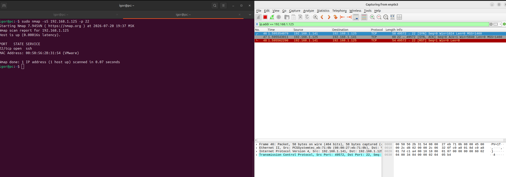

# Домашнее задание к занятию «Уязвимости и атаки на информационные системы» Дедяхин Игорь

### Задание 1

Скачайте и установите виртуальную машину Metasploitable: https://sourceforge.net/projects/metasploitable/.

Это типовая ОС для экспериментов в области информационной безопасности, с которой следует начать при анализе уязвимостей.

Просканируйте эту виртуальную машину, используя **nmap**.

Попробуйте найти уязвимости, которым подвержена эта виртуальная машина.

Сами уязвимости можно поискать на сайте https://www.exploit-db.com/.

Для этого нужно в поиске ввести название сетевой службы, обнаруженной на атакуемой машине, и выбрать подходящие по версии уязвимости.

Ответьте на следующие вопросы:

- Какие сетевые службы в ней разрешены?
- Какие уязвимости были вами обнаружены? (список со ссылками: достаточно трёх уязвимостей)
  
*Приведите ответ в свободной форме.*  

### Решение

Список сетевых служб:

Обнаруженные уязвимости:

1. [vsftpd 2.3.4 - Backdoor Command Execution](https://www.exploit-db.com/exploits/49757)
2. [MySQL 5.0.x - IF Query Handling Remote Denial of Service](https://www.exploit-db.com/exploits/30020)
3. [Samba 3.5.0 - Remote Code Execution](https://www.exploit-db.com/exploits/42060)

---

### Задание 2

Проведите сканирование Metasploitable в режимах SYN, FIN, Xmas, UDP.

Запишите сеансы сканирования в Wireshark.

Ответьте на следующие вопросы:

- Чем отличаются эти режимы сканирования с точки зрения сетевого трафика?
- Как отвечает сервер?

### Решение

Сканирование в режиме SYN. Отправляем пакет с фалгом SYN, получаем ответ SYN-ACK, соединение разрывается.

*Приведите ответ в свободной форме.*

